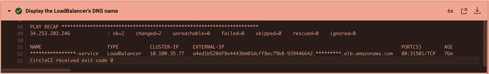

# Cloud DevOps Engineer Capstone Project

Capstone project for Cloud DevOps Engineer Nanodegree at Udacity.

## What did I learn?

- Using Circle CI to implement CI/CD
- Working with Ansible and CloudFormation to deploy clusters
- Building Kubernetes clusters
- Building Docker containers in pipelines

## Application

The application is a simple Flesk project based on python that display a html page with the text "Let's rock CI/CD". The base image is python:3.7-alpine

## Cloud Formation

AWS CloudFormation was used to build the Kubernetes Cluster.
- **VPC and Networking**, to setup VPC, Subnets
- **EKS** to craete the Kubernetes Cluster and Nodes
- **Management** and EC2 Instance used to configure and manage the Cluster 

### Stacks

### EC2 intances

## CircleCi Pipeline

## Linting using Pylint and Hadolint

## Ansible
Ansible playbooks were use to configure the cluster and the management instance

## Kubernetes Cluster
After deployment, the cluster can be inspected using kubectl

## Access the Application
Using the endpoint created for the K8S service

Access the application using a browser

